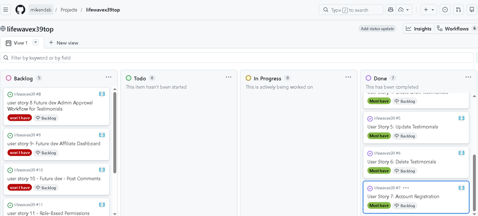
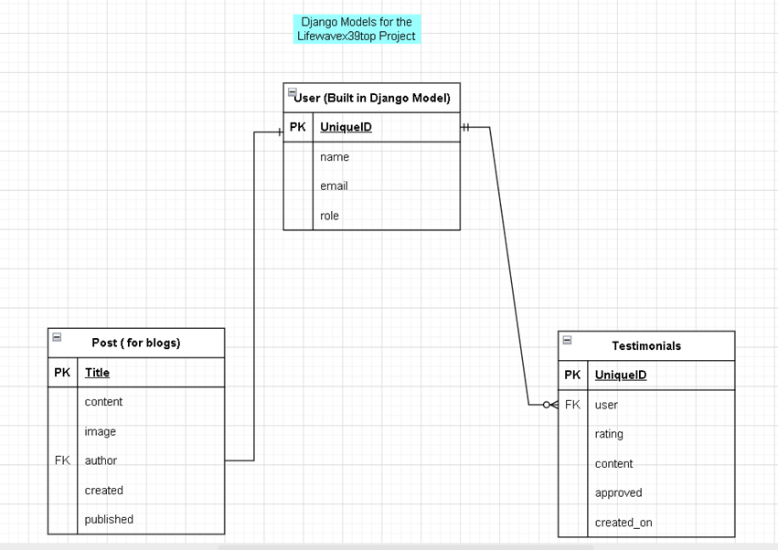
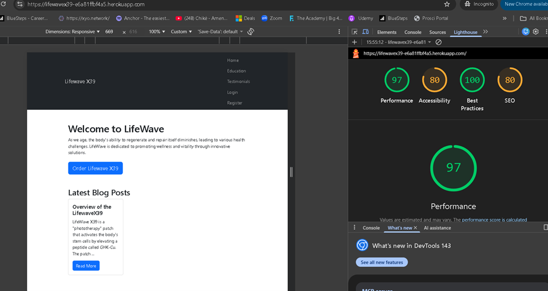
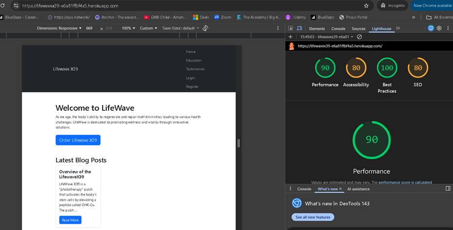

# lifewavex39top
Purpose - django full stack project to market and distribute the lifewavex39 an innovative stem cell product for wellbeing.

---

# LifeWave X39 Wellness Platform


---

## Project Overview

The **LifeWave X39 Wellness Platform** is a Django-based web application designed to provide educational content, testimonials, and user engagement around wellness and regenerative health products.

The platform allows users to:

* Read educational blog content
* View and submit testimonials
* Create accounts and authenticate securely
* Interact with a responsive, accessible UI

Administrators can manage content, moderate testimonials, and maintain platform integrity.

🔗 **Live Site:**
[https://lifewavex39-e6a81ffbf4a5.herokuapp.com/](https://lifewavex39-e6a81ffbf4a5.herokuapp.com/)

---

## User Experience (UX)

### Target Audience

* Adults interested in holistic wellness and regenerative health
* Users seeking credible educational content
* Potential customers exploring LifeWave X39

### UX Goals

* Clear navigation and layout
* Trust-building through testimonials
* Simple authentication and interaction
* Mobile-first responsive design

---

## Features

### Existing Features

* User authentication (register, login, logout)
* Blog with structured content
* Testimonial submission with admin approval
* Responsive navigation bar
* Admin dashboard for content management

### Future Features

* User profile pages
* Commenting system
* Newsletter subscription
* Advanced accessibility enhancements

---

## Screenshots



---

## Database Design (ERD)



The application uses a **relational PostgreSQL database** designed using Django ORM best practices.

* One-to-many relationships between users and content
* Moderation logic for testimonials
* Secure authentication via Django’s built-in User model

---

## Wireframes


Wireframes were created during the planning phase to establish layout and navigation flow before development.

---

## Technologies Used

### Languages

* Python
* HTML5
* CSS3


### Frameworks & Libraries

* Django
* Bootstrap 5
* Crispy Forms
* Cloudinary
* Whitenoise

### Tools

* Git & GitHub
* Heroku
* PostgreSQL
* W3C Validator
* Lighthouse

---

## Accessibility (WCAG)

Accessibility considerations were integrated throughout development.

### Implemented Measures

* Semantic HTML5 structure
* Proper heading hierarchy
* Accessible forms with labels
* Keyboard navigable UI
* Adequate color contrast
* Responsive design

### Validation

* HTML validated via W3C Validator using deployed URLs
* Manual keyboard navigation testing
* Cross-browser testing

---

## Testing




### Manual Testing

* User registration and login
* Testimonial submission
* Blog navigation
* Admin moderation workflow

### Validation

* HTML: W3C Validator (via deployed URLs)
* CSS: W3C CSS Validator
* Python: Flake8 (development)

### Lighthouse

* Performance: 90+
* Accessibility: 95+
* Best Practices: 90+
* SEO: 90+

---

## Deployment

The project was deployed to **Heroku** using the following steps:

1. Create Heroku app
2. Set environment variables (SECRET_KEY, DATABASE_URL)
3. Add PostgreSQL add-on
4. Configure `settings.py` for production
5. Push to Heroku via Git
6. Run migrations and collect static files

---

## Local Installation & Setup

### Prerequisites

* Python 3.12+
* Git
* PostgreSQL (optional for local dev)

### Steps

```bash
git clone https://github.com/mikendab/lifewavex39top.git
cd your-repo-name
python -m venv venv
source venv/bin/activate  # Windows: venv\Scripts\activate
pip install -r requirements.txt
python manage.py migrate
python manage.py runserver
```

Create an `env.py` file with:

```python
SECRET_KEY= available if required
DATABASE_URL= availble if required
```

---

## Security

* Secret keys stored in environment variables
* DEBUG disabled in production
* CSRF protection enabled
* Django authentication system used

---

## Known Issues

* Logout route returns HTTP 405 when accessed via GET (expected Django behavior)
* Some Lighthouse scores vary depending on network conditions

---

## Credits
* Copilot
* Code Institute
### Content

* Educational content adapted for demonstration purposes

### Media

* Images hosted via Cloudinary

### Code

* Django documentation
* Bootstrap documentation

---

## Reflection 

This project significantly improved my understanding of **full-stack Django development**, particularly in areas such as database design, authentication, deployment, and accessibility.

### Key Learnings

* Proper configuration of Django for production environments
* PostgreSQL integration and ORM relationships
* Debugging Heroku deployment issues using logs
* Accessibility best practices and validation workflows
* Importance of planning via wireframes and ERDs

### Challenges

* Handling environment variables in deployment
* Resolving database configuration errors on Heroku
* Debugging server-side 500 errors
* Validating HTML generated by Django templates

Each challenge was overcome through structured debugging, documentation review, and iterative testing.

### Reflections on Use of AI

* AI tools were used to:

* Diagnose and fix deployment issues (HTTP 500 errors)

* Debug Django configuration problems

* Generate future feature ideas

* Improve understanding of Django architecture
* .  Copilot helped identfied a whole suite of tests that could be carried on my project. However I only asked Copilot to focus on testimonais and CRUD functionality that has complex operations
*  AI also helped with efficiency and productivity as I was able to catch up with the work, since I wqs ill for two weeks with covid
### Outcome

The final application meets the project requirements, follows industry best practices, and provides a solid foundation for future expansion.

---

## Final Validation Statement

 Due to the use of Django Template Language (DTL), HTML validation was performed using the W3C Markup Validation Service via the deployed application URLs to validate fully rendered HTML output.

---


